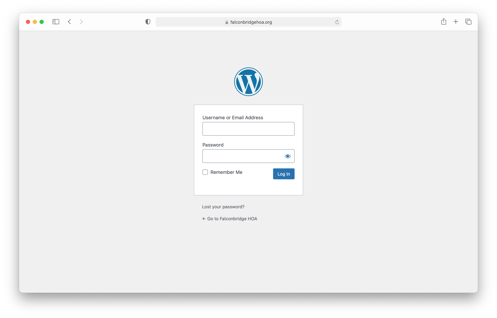
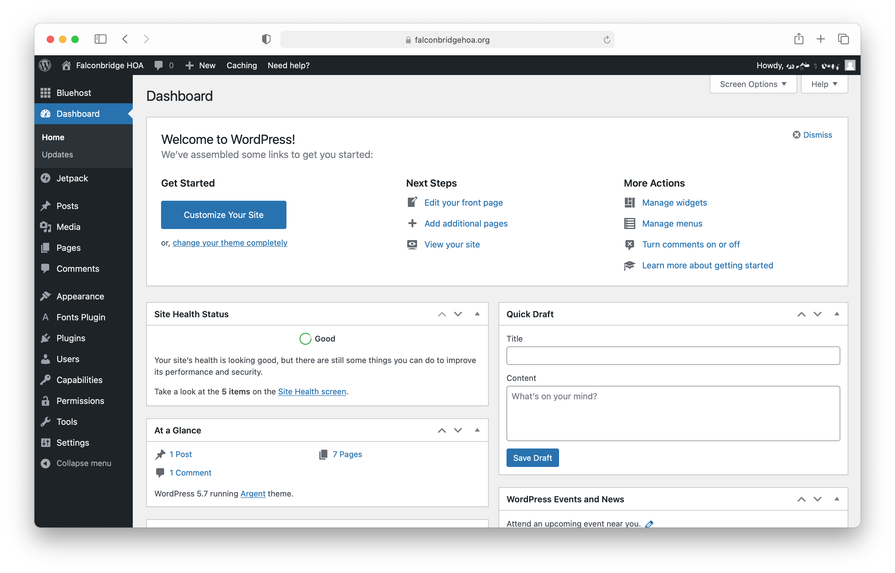
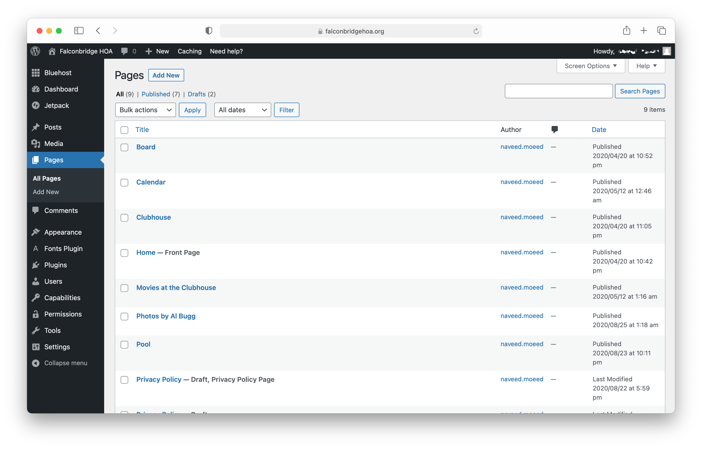
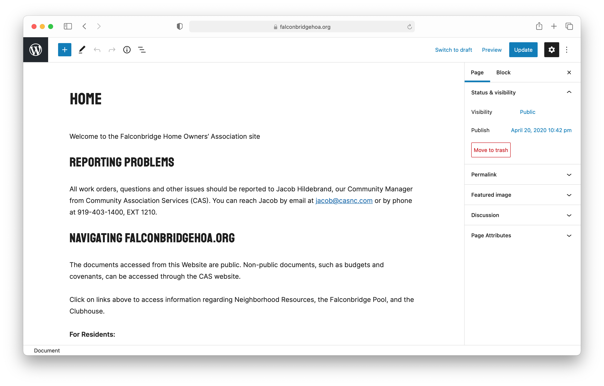
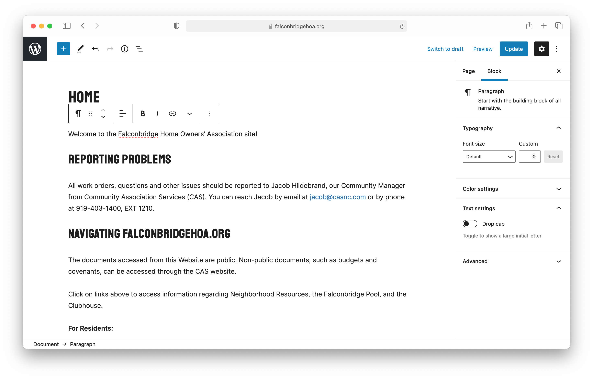
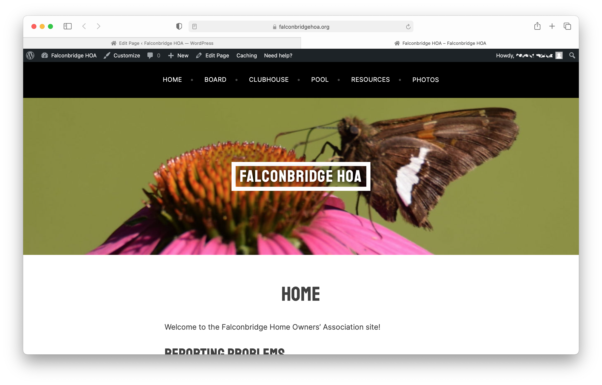
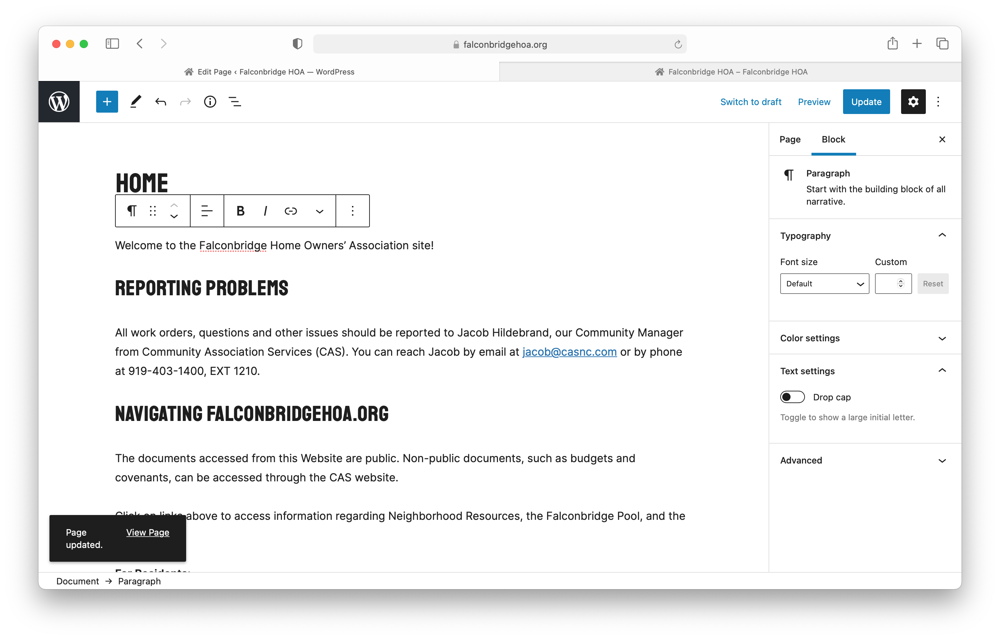

# Falconbridge HOA Site Documentation

## Logging In

Start by logging in to Wordpress. Go to https://falconbridgehoa.org/wp-admin/ and enter your login credentials.

Next, you will see the **Wordpress admin page**. From here you can make changes, add, and remove site content. By default, this will land on the Bluehost tab. The main page to see site information is the **dashboard**. Navigate the admin page with the bar on the left. 

## Editing a page

To edit a page, first click on "Pages" on the right.

Next, click on the page you want to edit. For this example, we'll edit "Home."

The next page is called the **block editor**. It's the easiest way to edit site content. Make any edits you would like to the site text, images, etc. In this example, let's add an exclamation mark to the welcome message.

Now, let's preview the changes. Click "Preview" in the top left, and then "Preview in new tab." This shows what visitors to the site will see when they load this page, but _doesn't_ publish the changes yet.

When we open the new tab, we can see that the exclamation mark was successfully added to the welcome message.

To publish the changes, go back to the block editor tab, then click "Update."

When you are done editing the page, return to the dashboard by clicking the Wordpress logo in the top left.

## Other things

Wordpress is a very powerful platform, with many capabilities. For more advanced features, such as editing permissions, adding fonts, and so on, please consult the official Wordpress documentation, [codex.wordpress.org](https://codex.wordpress.org/Main_Page).